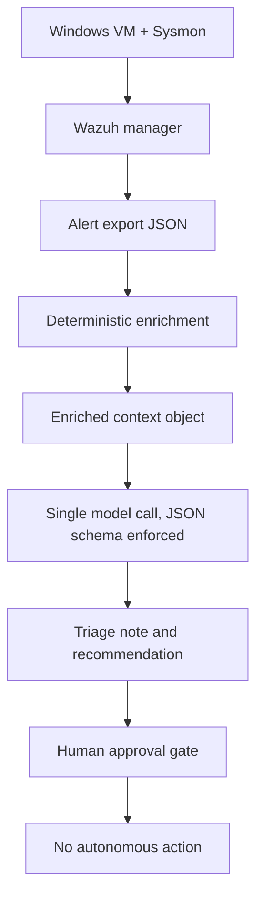

# agentic-soc-lab

Homelab agentic SOC: Wazuh alerts → deterministic enrichment → cited triage notes behind a human approval gate.

## Guardrail

This repository is a **personal lab on personal hardware**.

- **No production data. Ever.**
- Synthetic telemetry only, generated on this lab.
- When phishing samples exist, these will come from public research datasets only.
- Nothing from an employer environment enters this repo, these prompts, or these models.
- Nothing from this lab is copied onto work systems.

This is personal study. It is not a work deliverable and it does not contain organization data.

## Problem

SOC triage is mostly mechanical enrichment plus a smaller amount of judgment. Most "AI SOC" demos invert that: they hand the raw alert to a model and hope the write-up is right.

That fails in predictable ways:

- The model treats attacker-controlled fields as instructions.
- It asserts conclusions that are not in the evidence.
- There is no number for precision, recall, or false-negative rate.
- There is no log of what the model saw, said, or cost.
- Autonomy is implied before anyone has measured the error.

This lab is the opposite shape. Code does the mechanical work. The model writes a cited note from already-enriched context. A human approves any action. Accuracy is measured against a labeled set.

## Scope (v0)

One Wazuh alert path, end to end:

1. Synthetic Windows/Sysmon telemetry produces an alert in Wazuh.
2. Deterministic enrichment builds a context object (reputation, hash, CVE, asset, ATT&CK).
3. One model call, given that context and never the raw alert, returns structured JSON: verdict, confidence, evidence citations, recommended action.
4. The note stops at a human approval gate. Nothing acts autonomously.
5. Twenty labeled alerts in `golden_set.json` are the scoreboard.

Out of scope for v0: phishing triage, detection-as-code CI, multiple models, autonomous containment, any production integration.

## Architecture

## Inference split:

| Task | Where | Why |
|---|---|---|
| Enrichment, mapping, caching | Local Python | Mechanical, testable, free |
| Embeddings / cheap classification | Local CPU | No reason to pay for this |
| Triage note + verdict | Cheap hosted API | This is the only step that needs a general model |
| Fine-tuning | Not in v0 | Not required for this problem |

Hard cost ceiling: **$10** for the v0 build, set in the provider console before any model call is written.

## Deterministic vs model-driven

This table is the design. The code exists to implement it, not the other way around.

| Step | Owner | Reasoning |
|---|---|---|
| Ingest Wazuh alert | Code | Parsing is mechanical. Do not let the model see raw attacker-controlled fields first. |
| IP / hash / CVE lookups | Code | These are API lookups with a cache. A model adding "reputation" by vibe is how false confidence starts. |
| Local asset context (owner, criticality, expected software) | Code | Static lab inventory. YAML or SQLite. Faked is fine; invented by the model is not. |
| ATT&CK technique mapping from event ID + command line | Code | Deterministic mapping can be wrong, but it is reviewable and testable. |
| Prompt-injection handling on untrusted fields | Code | Strip / wrap / refuse before the model call. Do not ask the model to ignore instructions in the input. |
| Verdict, confidence, cited note, recommended action | Model | Judgment over the enriched object. Every claim must cite an enrichment field. Uncited sentences are rejected. |
| JSON schema validation and retry | Code | Malformed output is a failed call, not a parse-it-anyway event. |
| Approve or reject the recommended action | Human | v0 has no autonomous action path. The gate is the product. |
| Score verdicts against labels | Code | Precision, recall, FPR, FNR. The number is the point. |
| Log prompt, response, tools, tokens, cost, latency | Code | If you cannot reconstruct why a verdict happened, you cannot defend it. |

## Measurement

`golden_set.json` is tracked in git on purpose. It is the contract.

Target for v0: ~20 labeled alerts, roughly balanced true positives and benign-but-noisy false positives.

| Metric | v0 result |
|---|---|
| Precision | *not measured yet* |
| Recall | *not measured yet* |
| False-positive rate | *not measured yet* |
| False-negative rate | *not measured yet* |
| Inference cost | *not measured yet* |

Failures will be listed individually: what the alert was, what the model said, and the hypothesis for why. The failure list is a deliverable, not a footnote.

## Status

Design only. No application code in this commit.

Next: labeled synthetic telemetry, then enrichment with no model in the loop.
